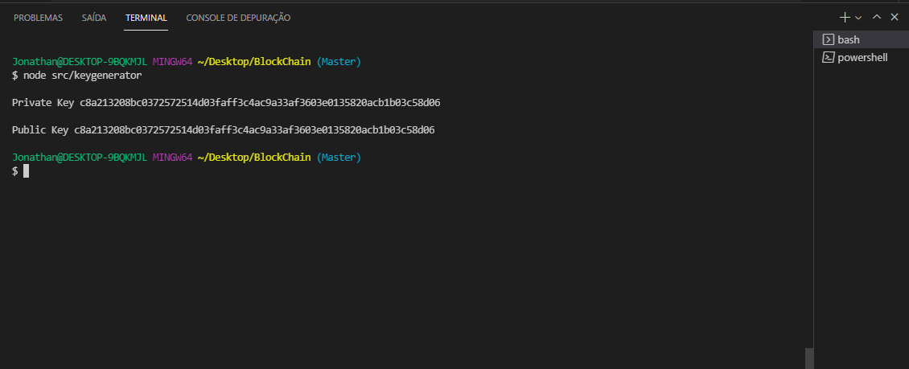
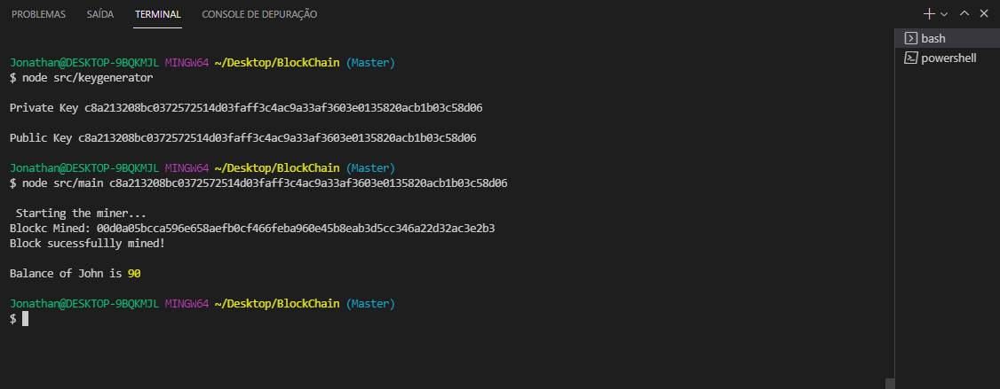

# Blockchain-Js
this is my blockchain made in javascript using node js with modules

## Installation

use the package manager [npm](https://www.npmjs.com/package/crypto-js) to install crypto-js.

Terminal
````
npm install crypto-js
  ````

use the package manager [npm](https://www.npmjs.com/package/elliptic) to install elliptic.

  Terminal
  
````  
npm install crypto-js
````

##  How run code 

first run 
```` 
node src/keygenerator
````


copy the generated private key write

example key: c1610fcbaa50e48a9b6694f9b738429471897bb4c65bcbe6cd483f8a15192069

````
node src/main.js PastePrivateKeyHere

``````


with genereted private key and that's it , see it mining block

then he will start mining our translation
